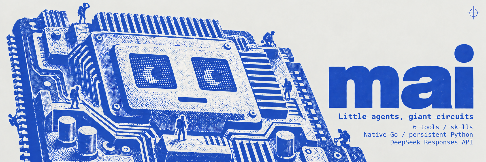

# mai



**Give a repository task to a small Go agent, then pick it up later with
searchable history and portable checkpoints.**

Mai runs on macOS and Linux and uses the Responses API through Enclave,
DeepSeek, OpenRouter, or another configured provider. It can read
code, edit files, run checks, and return a final answer from your terminal.

[](go.mod)
[](internal/mai/app.go)

```sh
git clone https://github.com/voladelta/mai.git
cd mai
go install ./cmd/mai
```

Requires Go 1.27+ to build and an API key for the selected provider to run tasks.
Enclave is the built-in default, using `ENCLAVE_API_KEY`.
See [Installation](#installation) for binary location and `PATH` setup.

[Quick start](#quick-start) · [CLI](docs/cli.md) · [Tools](docs/tools.md) ·
[Sessions](docs/sessions.md) · [JSONL events](docs/events.md)

## Why Mai?

Repository work often spans several tool calls and follow-up requests. Mai
keeps that work in a terminal workflow: start a task, let the agent inspect and
change the code, then save the conversation when you need to return to it.

| Capability | What it gives you | Try it |
| --- | --- | --- |
| Repository work | Bash, guarded file reads/writes/edits, local image inspection, and a persistent Lua tool for data shaping (CSV, JSON, logs). | `mai "fix the empty-input crash and run tests"` |
| Saved tasks | Resume the original directory, provider settings, model, and conversation. | `mai "continue the fix" --last` |
| Model selection | The provider's configured model at high effort by default; override either for one run. | `mai "review this refactor" --effort max` |
| Provider selection | Route the task to a different endpoint and credential. | `mai "quick review" --provider openrouter --model deepseek/deepseek-v4-pro` |
| Searchable history | Recall original visible text after compaction. | [Lua history search](docs/tools.md#persistent-lua) |
| Repository skills | Load project instructions before global skills, with explicit skill selection. | `mai 'Use $my-skill to review this package'` |
| Script output | Stream task, model, and tool events as JSON Lines. | `mai "review this package" --jsonl --no-input > run.jsonl` |

The Go runtime has one third-party dependency, the embedded
[go-lua](https://github.com/Shopify/go-lua) Lua interpreter (MIT) behind the `lua` tool.

## Quick start

After installing Mai:

1. Set your API key in the shell that will launch it:

   ```sh
   export ENCLAVE_API_KEY='your-api-key'
   ```

2. Change into the repository you want Mai to work on:

   ```sh
   cd /path/to/your/repository
   ```

3. Start a task, inspect the changes, and continue the saved conversation:

   ```sh
   mai "fix the parser's empty-input crash and run the relevant tests" --persist
   git diff
   mai "review the fix for edge cases" --last
   git diff --check
   mai --help
   ```

Replace the key and repository path with your own values. Task commands make
paid requests to the selected provider.

Tasks are stateless by default. Use `--persist` to save a new task and `--last`
to resume the current saved task in the same project. Only one process can use
a particular saved task at a time.

## Installation

### Requirements

- **macOS or Linux**, with `/bin/bash` for the Bash tool.
- **Go 1.27 or later** to build from source.
- **A provider API key** in its configured environment variable. The built-in
  Enclave provider uses `ENCLAVE_API_KEY`.
- **Git** for repository-root discovery. Without it, the working directory is
  the repository boundary.

No Node runtime, SDK, or external interpreter is required.

### Install from a checkout

```sh
git clone https://github.com/voladelta/mai.git
cd mai
go install ./cmd/mai
```

Go installs into `GOBIN` when set, otherwise `$(go env GOPATH)/bin`. Add that
directory to your shell's `PATH`. For the default Go binary directory:

```sh
export PATH="$(go env GOPATH)/bin:$PATH"
mai --version
```

### Build a local binary

From the cloned repository:

```sh
go build -o mai ./cmd/mai
./mai --help
```

Move the binary into a directory on `PATH` to use it from other projects.

### Run from source

From the cloned repository, show help without installing a binary:

```sh
go run ./cmd/mai --help
```

When running a task this way, the clone is the working repository. Use an
installed or built binary to work in another project.

## Models and commands

```sh
mai "add useful tests for the parser"                                # Configured model/high
mai "review the implementation carefully" --effort max              # Configured model/max
mai "quick review" --provider enclave --model cyberouter/glm-5.3-flash  # One-off model override
mai "continue the saved task" --last                                # Resume the saved settings
```

Each configured provider sets one `model`, which Mai sends upstream exactly as
written. `--model` (or `-m`) overrides it for the current run only;
`--effort` selects `l`, `h`, or `max` reasoning (default `h`). The provider
comes from `--provider`, the selected config's `default_provider`, or the
built-in Enclave default.

`--last` keeps the saved provider, endpoint, model, and reasoning effort.
Plain `--last` ignores current `.mai.config` files. `--last --provider NAME`
loads the selected config and adopts that provider's configured model, since a
saved model ID is provider-specific; `--last --model NAME` and
`--last --effort VALUE` override the saved values. Credentials are read afresh
from the saved environment-variable name, so API key rotation does not require
a new task.

The default run limit is 64 model turns. Increase it or use `-1` for unlimited
turns until completion, error, or interruption:

```sh
mai "complete the migration" --max-turns 128 --persist
mai "continue the migration" --last --max-turns -1
mai "review this package" --jsonl --no-input > run.jsonl
```

See the [CLI reference](docs/cli.md) for every option, examples, and timeouts.

## Configuration

Mai reads JSON from `.mai.config` in the current working directory, otherwise
from `$HOME/.mai.config`. The local file takes priority; files are not merged,
and an invalid local file fails instead of falling back. With neither file,
Mai uses the built-in Enclave provider. Help, version, and plain `--last` do not
load config.

Copy [the complete example](.mai.config.example) to either location:

```sh
cp .mai.config.example "$HOME/.mai.config"
export OPENROUTER_API_KEY='your-openrouter-key'
export ENCLAVE_API_KEY='your-enclave-key'
mai "quick review" --provider openrouter
mai "quick review" --provider enclave --model cyberouter/glm-5.3-flash
```

The config contains `default_provider` (defaults to `enclave` when omitted)
and a `providers` object. Each provider defines `base_url`, `api_key_env`, and
one `model`. Model IDs are sent exactly as written; `--model` or `-m` selects a
different ID on the same provider, so one `enclave` entry can serve both
`cyberouter/deepseek-v4.1-flash` and `cyberouter/glm-5.3-flash`.

Set `profile` to `deepseek` for native DeepSeek, `openrouter` for OpenRouter,
or `responses` for other Responses providers. The profile controls maximum-effort
translation and reasoning replay independently of the configuration name.
When omitted, existing behavior is preserved: `deepseek` uses the DeepSeek
profile, `openrouter` uses the OpenRouter profile, and other names use Responses.
Set it explicitly when giving a provider a custom name.

Mai appends `/responses` to `base_url`; all providers use the Responses API.
Use environment-variable names for keys, never literal credentials. Unknown
fields, missing mappings, unknown providers, and missing selected credentials
produce errors. Config files must be regular files no larger than 1 MiB.

Change only `default_provider` to switch your usual backend. `--provider NAME`
overrides it for one run. Checkpoints use the selected provider and its model. `.mai.config` is ignored in this checkout.

| Variable | Purpose | Default |
| --- | --- | --- |
| `ENCLAVE_API_KEY` | Credential for the built-in Enclave provider. | Unset |
| `DEEPSEEK_API_KEY` | Credential named by the example's DeepSeek provider. | Unset |
| `OPENROUTER_API_KEY` | Credential named by the example's OpenRouter provider. | Unset |
| `MAI_BASE_URL` | Override the complete Responses endpoint for the built-in default provider (`enclave`) only; HTTPS required except for loopback. | `https://router.enclave.ai/v1/responses` |
| `MAI_CONTEXT_WINDOW` | Input context budget, from 32,768 to 1,000,000 tokens. | `1000000` |
| `MAI_DEPTH` | Nesting depth of this run; Mai sets it for the subprocesses it launches. | `0` |
| `MAI_MAX_DEPTH` | Maximum permitted `MAI_DEPTH`; deeper nested runs refuse to start. | `2` |

For example, lower the context budget:

```sh
MAI_CONTEXT_WINDOW=65536 mai "investigate the failure"
```

The API credential is read from the environment and is not copied into saved
task state or Mai's own logs. Shell commands run by the agent inherit its OS
access and can access that environment.

## Design and architecture

Mai follows four principles:

- **Keep the runtime small.** A Go binary owns the model loop, tools, and local
  state; an embedded Lua interpreter supports scripted exploration.
- **Save only when asked.** A normal run leaves no saved conversation.
  `--persist` and `--last` use project-local state.
- **Keep original evidence accessible.** Compaction archives the original
  visible history to a transcript file; `mai.history` still reads the original
  text.
- **Make recovery explicit.** Failed requests and interrupted tool calls are
  never replayed automatically.

```text
Prompt + CLI options + provider config
         |
         v
Go agent loop <----> Selected provider's Responses API (streaming)
         |
         +--> Bash / file reads and edits / skills / images
         +--> Persistent Lua cells --> Go tool bridge
         +--> Nested `mai` subprocesses via Bash (depth-limited)
         |
         +--> Terminal text or JSONL events
         +--> With --persist / --last: .mai/ session + history archive
```

Mai sends local conversation history, including provider reasoning, with model
requests. At 80% of the context budget it builds a readable checkpoint. The
original visible history remains searchable; checkpoints are model-authored
summaries, so useful details may still need retrieval.

| Approach | Repository workflow | Continuity | Execution |
| --- | --- | --- | --- |
| Mai | Model chooses tools, edits files, and runs checks. | Optional saved tasks, checkpoints, and history search. | Go harness runs tools locally. |
| Direct API script | You implement the tool loop and integrations. | You implement storage and context management. | Your script dispatches operations. |
| Manual terminal work | You inspect, edit, and run every command. | You keep notes and shell history. | You run each operation yourself. |

## Limits and safety

Bash is **not sandboxed**, and `lua` cells reach the same OS access through `mai.bash`. File tools enforce repository
boundaries, and Mai asks for approval for recognizable `rm` commands with
external or unresolved targets. That check covers `rm` only; other commands
can overwrite or delete data. `--no-input` rejects approval requests.

- The configured model must accept inline images for image tools to help;
  there is no runtime capability check.
- Portable compaction currently handles text histories. Older image-bearing
  records may require a new task or text-only history.
- There is no mid-turn steering or automatic retry of failed work.
- Saved tasks must use the supported state format; incompatible older files
  require a new task.
- Smaller contexts and checkpoints can add model requests and change cache
  reuse. No general speed or cost advantage is claimed.

See [Tools and skills](docs/tools.md#safety) for execution boundaries and
[Sessions and context](docs/sessions.md) for storage and recovery details.

## Troubleshooting

| Symptom | Action |
| --- | --- |
| `mai: command not found` | Add `GOBIN`, or the default Go binary directory, to `PATH`; use `./mai` for a local build. |
| `provider "enclave" requires ENCLAVE_API_KEY` | Export the selected provider's key in the shell launching Mai. |
| `provider "enclave" is not configured` | Add the provider to the selected `.mai.config`; the local file replaces the home file. |
| `no saved task in this project` | Start with `--persist`, then resume from the same project. |
| `session ... is already running` | Wait for the process using that task to exit, or start a separate task. |
| `agent stopped after 64 model turns` | Resume a persisted task with a larger `--max-turns` value or `-1`. |
| `input_image` errors from a provider | Switch to a model that accepts inline images, or keep the history text-only. |
| `Responses request failed (network or timeout)` | Check connectivity and the selected provider's endpoint; raise `--timeout` if needed. |

An interrupted tool call has an unknown outcome on resume. Inspect its file
and command effects before repeating work that may already have happened.

## FAQ

### Does Mai save every conversation?

No. Use `--persist` for a new saved task; ordinary runs are stateless.

### Where are saved tasks stored?

Under `.mai/` at the Git repository root, or in the working directory outside
Git. Keep the session JSON and transcript archive together when backing up a task.

### Can I switch models when resuming?

`--last` keeps the saved model and reasoning effort; `--model` and `--effort`
override either for the resumed run. `--last --provider NAME` can switch
providers if the previous one runs out of credits; it adopts the new provider's
configured model.

### Can I use Mai in scripts?

Yes: use `--jsonl --no-input`. Progress goes to stderr, events to stdout.
See [JSONL events](docs/events.md) for usage fields and timing rules.

## About contributions

For repository changes, describe the problem, resulting behavior, and checks
you ran. From the repository root, the local checks are:

```sh
go test -race ./...
go vet ./...
```

## License

This repository currently contains no license file.
